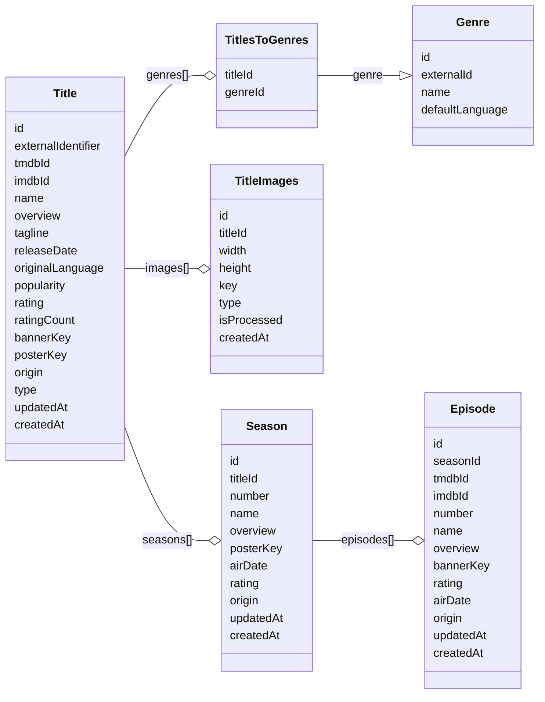
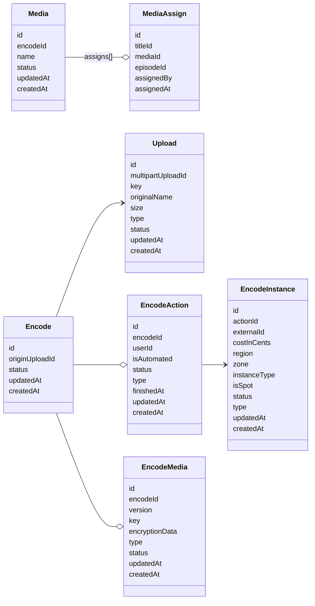
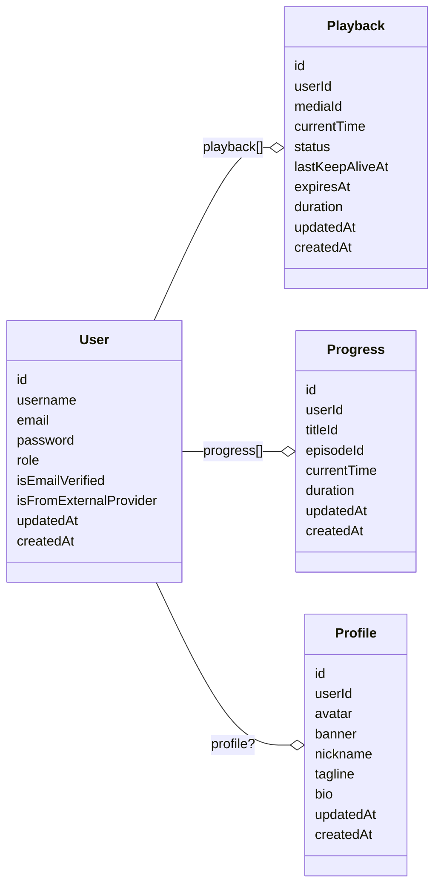

# MyStreaming

Uma plataforma de streaming completa, desde um catálogo bonito até o *encode/transcode* de vídeos.

Esse repositório contém:

1. [server](server) a api completa.
2. [clients/web-app](clients/web-app) uma aplicação react com todo o front-end.
3. [packages/encoder](packages/encoder) um pacote responsável por *encode/transcode* dos vídeos.
4. [infra/pulumi](infra/pulumi) toda a infraestrutura necessária para rodar o projeto.

## Conteúdo

- [Sobre](#sobre)
- [Imagens](#imagens)
- [Instalação](#instalação)
- [Usar](#usar)
- [Infraestrutura](#infraestrutura)
- [Pacotes](#api)
  - [API](#api)
  - [Front end](#front-end)
- [Desafios](#desafios)
- [Progresso](#progresso)
- [Mantedores](#mantedores)
- [License](#license)

## Sobre

Gosto muito de assistir filmes e séries desde que me entendo por gente. Com todas essas diferentes plataformas de streaming disponíveis, muitas deixam a desejar. Logo, me veio a brilhante ideia de criar a minha própria, assim surgindo a **MyStreaming**!

Um dos principais problemas que eu vejo é a experiência do usuário, por isso a **MyStreaming** foi criada com o principal foco nesse ponto, oferecendo uma experiência fluida, funcional e elegante.

No meio do caminho, me deparei com um problema, streaming de vídeo é bem mais complicado do que aparenta. Procurei soluções em cloud, mas todas acabam sendo muito caras, sendo assim decidi criar minha própria solução, uma [aplicação](packages/endcoder) feita para rodar em qualquer VPS totalmente personalizada com as configurações ideais visando qualidade e custo.

## Imagens


## Instalação

Esse projeto utiliza [bun](https://bun.com/) para a **API** e [node](http://nodejs.org) para o front-end

Para rodar o projeto na sua máquina primeiramente clone esse repositorio e em seguida execute o comando abaixo no diretorio principal.

```sh
$ bun install
```

## Usar

Para finalmente iniciá-lo, primeiro acesse a pasta do servidor, em seguida configure todas as variáveis de ambiente seguindo o [.env.example](server/.env.example). Após isso, será necessário rodar todas as _migrations_ para o banco de dados, utilize o comando abaixo:

```sh
$ bunx drizzle-kit migrate
```

Após isso, você pode iniciar o servidor utilizando normalmente o comando:

```sh
$ bun run dev
```

Agora vamos iniciar o front-end, basta acessar a pasta [clients/web-app](clients/web-app) e iniciar o projeto utilizando o comando:

```sh
$ npm run dev
```

Pronto, a aplicação estará rodando na sua máquina em seu ambiente de desenvolvimento. Caso queira rodar a aplicação completa em um ambiente de produção, veja [Infraestrutura](#infraestrutura).

## Infraestrutura

Para seguir adiante, é necessário ter o [pulumi](https://www.pulumi.com/docs/iac/download-install/) instalado.

Caso queira rodar a aplicação completa com apenas um comando, siga os passos de [instalação](#instalação), logo após isso entre na pasta [infra/pulumi](infra/pulumi) e digite o seguinte comando:

```sh
$ pulumi up
```

**O código IAC ainda não está finalizado.**

## API

A API da aplicação está disponível em [server](server), ela foi projetada inicialmente em duas partes: [app](server/src/app) e [infra](server/src/infra). A pasta app contém toda a lógica da aplicação, a pasta Infra conecta essa lógica com serviços externos, sendo eles S3, SQS, EC2, Postgres e, por fim, [ElysiaJS](https://elysiajs.com) como sua interface HTTP.

Ela foi projetada para rodar como uma aplicação serverless, tendo assim seus custos reduzidos.

Principais bibliotecas utilizadas:

- [AWS SDK](https://aws.amazon.com/pt/sdk-for-javascript/)
- [Casl](https://casl.js.org/v6/en/) (Gerenciamento de cargos, RABC)
- [Drizzle](https://orm.drizzle.team/) (Integração com banco de dados)
- [ElysiaJS](https://elysiajs.com)
- [zod](https://zod.dev/) (Criação de schemas)

## Front end

O front-end está disponível em Webapp, uma aplicação feita utilizando React e React Router v7, contendo toda a interface da plataforma e também um painel administrador no qual é responsável por todas as informações e ações disponíveis.

A aplicação é dividida em 3 layouts, sendo eles: Public, Private, Internal.

- Public: É responsável por todas as páginas para usuários não autenticados.
- Private: É responsável por todas as páginas nas quais é necessário estar autenticado.
- Internal: É responsável por páginas que requerem um cargo específico.

Todas as páginas que utilizam os layouts: Public e Private, são renderizadas pelo lado do servidor. As páginas que utilizam o layout Internal são renderizadas pelo cliente.

Principais bibliotecas utilizadas:

- [React Route V7](https://reactrouter.com/home)
- [TailwindCSS](https://tailwindcss.com/) (Estilização)
- [Motion](https://motion.dev/docs/react) (Animações)
- [DashJS](https://dashjs.org/) (Reprodução de videos em dash)
- [Zustand](https://zustand.docs.pmnd.rs/getting-started/introduction) (Gerenciamento de estado)
- [React Query](https://tanstack.com/query/v5/docs/framework/react/overview) (Gerenciar queries)
- [Recharts & Shadcn](https://ui.shadcn.com/docs/components/chart) (Graficos)

## Desafios

### Geração de imagens.

Uma das partes essenciais dessa plataforma é a experiência do usuário, com isso uma coisa era imprescindível, a elegância ao apresentar o catálogo.

O principal provedor de dados da plataforma é o TMDB, porém com ele recebemos 2 tipos diferentes de imagens: um banner sem conter nenhuma informação do título e uma logo.

Para solucionar esse problema de uma maneira eficiente e que não vá consumir mais dados do que o necessário do usuário, criei uma função lambda que recebe itens de uma fila SQS e os processa.

Na função lambda, é iniciado um navegador utilizando o Puppeteer, recebemos a URL do banner e da logo pelo próprio evento SQS, juntamos os dois e aplicamos um background linear. Após isso, geramos um print da tela, realizamos o upload da imagem para o S3 e enviamos uma requisição para a API mostrando que a imagem foi processada com sucesso.

Tendo assim uma geração de imagens na qual somente títulos que são vistos pelo usuário são enviados para a fila SQS, com imagens personalizadas que se integram com o layout do site e com uma ótima disponibilidade sem depender de serviços externos como o CDN da TMDB.

### Processamento de vídeos.

O maior desafio encontrado foi realizar o processamento de vídeo de uma forma eficiente, visando custo baixo, uma qualidade de vídeo boa e uma compressão ótima, e contando com a possibilidade de processar mais de 1 vídeo em paralelo.

Esse processamento precisa passar por algumas etapas, entre elas:

- Upload: Optei por utilizar o S3 por conta de sua API que se tornou um padrão entre tantos outros storages.

- Transcodificação: A principal dificuldade, um processo lento e muito custoso computacionalmente. Atualmente existem 2 principais codecs utilizados para a reprodução de mídia, sendo eles o H264 (avc) e o H265 (HEVC). Cada um tem seus pontos positivos e negativos. O H264 é mais rápido e barato, porém o H265 proporciona uma eficiência maior (qualidade maior e uma melhor compressão), porém não tão rápido. Para tomar essa decisão, realizei muitos testes com diferentes opções ao processar o vídeo. No final, a opção que mais se alinhou aos objetivos foi o codec H265 para a qualidade principal, nas demais qualidades foi utilizado o codec H264 visando sua performance.

- Packager: Após gerarmos o vídeo com as diferentes qualidades, precisamos empacotar isso em Dash para a reprodução em navegadores. Utilize o Shaka-Packager para isso, ele foi responsável por empacotar todas as diferentes qualidades de vídeos, faixas de áudio e faixas de legenda, e encriptar todas as faixas utilizando CommonKeys.

- Processamento: Para fazer tudo isso, precisamos de um computador potente. Depois de muita pesquisa e muitos testes, a opção mais viável foi utilizar uma instância EC2 Spot para cada vídeo. A instância ideal foi a c8g.2xlarge, ela traz um tempo de processamento aceitável, com uma média de 1-2h por vídeo de 40-50min com um input em 4k e uma saída padrão a 1080p, 720p, 360p, 148p. Com um custo aproximado de 22 centavos de dólar por processamento.

- Para finalizar o processo, o pacote Dash com todas as faixas é enviado para o S3.

Principais opções usada no FFMPEG:

1080p (h265, qualidade principal para videos 1080p+):

```sh
-an # Remover audio da faixa
-v:c libx265
-crf 10 # Quanto maior -Tamanho de arquivo -Qualidade
-preset medium # Um preset um tanto quanto lento porem eficiente visando qualidade e compressão
-maxrate 12000000 -bufsize (6.000*12000000)/8 # Máximo de 12k de bitrate
-vf scale=1920:1080 # Redimensionar video
-pix_fmt yuv420p10le
-movflags +faststart
```

720-plus (h265, qualidade principal para vídeos até 720p):

```sh
-an # Remover audio da faixa
-v:c libx265
-crf 18 # Quanto maior -Tamanho de arquivo -Qualidade
-preset medium # Um preset muito rápido, menor qualidade porem mais performance
-maxrate 5000000 -bufsize (6.000*5000000)/8 # Máximo de 5k de bitrate
-vf scale=1280:720 # Redimensionar video
-pix_fmt yuv420p10le
-movflags +faststart
```

720p (h264, qualidade secundária):

```sh
-an # Remover audio da faixa
-v:c libx264
-crf 28 # Quanto maior -Tamanho de arquivo -Qualidade
-preset veryfast # Um preset muito rápido, menor qualidade porem mais performance
-maxrate 4000000 -bufsize (6.000*4000000)/8 # Máximo de 4k de bitrate
-vf scale=1280:720 # Redimensionar video
-pix_fmt yuv420p10le
-movflags +faststart
```

480p (h264, qualidade secundária):

```sh
-an # Remover audio da faixa
-v:c libx264
-crf 28 # Quanto maior -Tamanho de arquivo -Qualidade
-preset veryfast # Um preset muito rápido, menor qualidade porem mais performance
-maxrate 2000000 -bufsize (6.000*2000000)/8 # Máximo de 2k de bitrate
-vf scale=854:480 # Redimensionar video
-pix_fmt yuv420p10le
-movflags +faststart
```

360p (h264, qualidade secundária):

```sh
-an # Remover audio da faixa
-v:c libx264
-crf 28 # Quanto maior -Tamanho de arquivo -Qualidade
-preset veryfast # Um preset muito rápido, menor qualidade porem mais performance
-maxrate 1000000 -bufsize (6.000*1000000)/8 # Máximo de 1k de bitrate
-vf scale=480:360 # Redimensionar video
-pix_fmt yuv420p10le
-movflags +faststart
```

## Progresso

Lista das principais funcionalidades pendentes:

- [ ] Finalizar a criação de instancia EC2 para cada encode.
  - Ao realizar o upload de um arquivo de video um encode é criado com o status **PENDENTE**, após isso devemos iniciar uma instancia EC2 rodando nossa aplicação [packages/encoder](#encoder) assim processando o video por completo.
- [ ] Finalizar painel de administrador (catalog, populate, encodes)
  - Finalizar sessão de catalogo, e centro de media.
- [ ] Integração social
  - Sistema de amigos, watch party, e recomendações.

## Estrutura

#### Catalogo



#### Conteúdo



#### Usuários



## Conceitos e lógica

Em breve.

## Mantedores

[@zyxsz](https://github.com/zyxsz)

## License

[MIT](LICENSE) © zyxsz
